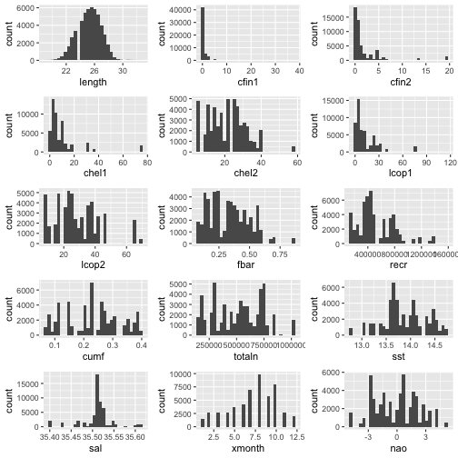
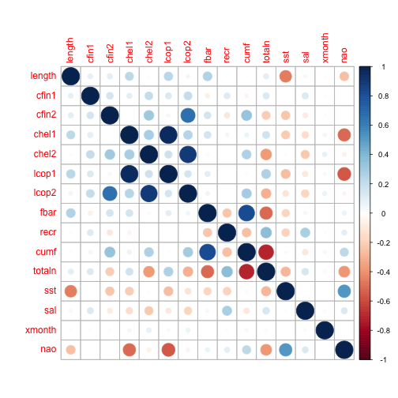
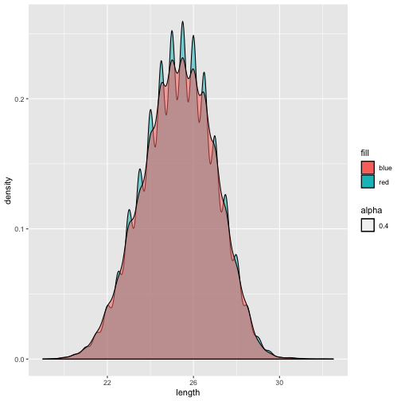
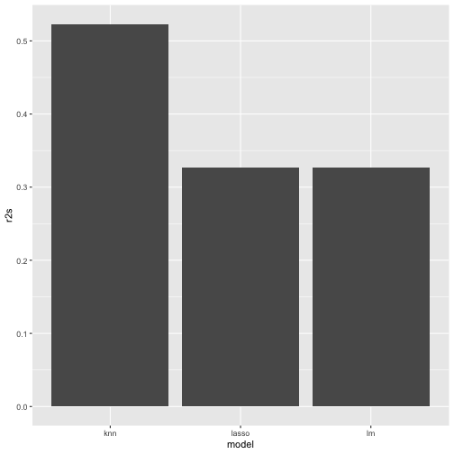
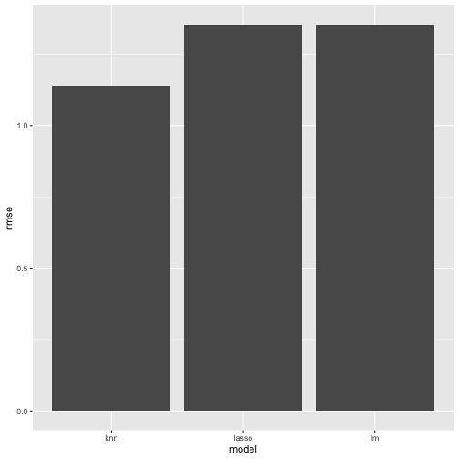
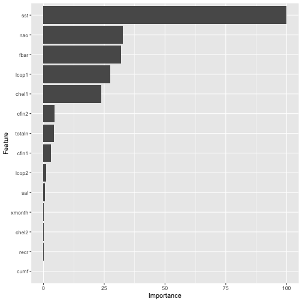

# Analiza danych o połowie śledzi
1. [Wyniki analizy](#wyniki-analizy)
2. [Przygotowanie](#przygotowanie)
3. [Przegląd i czyszczenie danych](#przegląd-i-czyszczenie-danych)
4. [Wstępna analiza](#wstępna-analiza)
5. [Korelacja między zmiennymi](#korelacja-między-zmiennymi)
6. [Zmiana rozmiaru śledzi w czasie](#zmiana-rozmiaru-śledzi-w-czasie)
7. [Budowa modelu regresji](#budowa-modelu-regresji)
  * [Regresja liniowa](#regresja-liniowa)
  * [kNN](#knn)
  * [Lasso](#lasso)
  * [Porównanie wyników](#porównanie-wyników)

## Wyniki analizy
Z biegiem czasu można zaobserwować stopniowe zmniejszanie się długości śledzi wyławianych w Europie.
Powodem mogą być zmiany klimatczne i zbyt mocna ingerencja w morski ekosystem przez połowy.

## Przygotowanie

Wczytanie bibliotek:

```r
library(dplyr)
library(ggplot2)
library(gridExtra)
library(corrplot)
library(gganimate)
library(caret)
library(knitr)
```

Zapewnienie powtarzalności eksperymentów:

```r
set.seed(0xC0FFEE)
```

Wczytanie pliku z danymi:

```r
herrings <- tbl_df(read.csv('sledzie.csv'))
```

## Przegląd i czyszczenie danych

```r
names(herrings)
```

```
##  [1] "X"      "length" "cfin1"  "cfin2"  "chel1"  "chel2"  "lcop1"  "lcop2" 
##  [9] "fbar"   "recr"   "cumf"   "totaln" "sst"    "sal"    "xmonth" "nao"
```

```r
head(herrings)
```

```
## # A tibble: 6 x 16
##       X length cfin1 cfin2 chel1 chel2 lcop1 lcop2  fbar   recr  cumf totaln
##   <int>  <dbl> <fct> <fct> <fct> <fct> <fct> <fct> <dbl>  <int> <dbl>  <dbl>
## 1     0   23   0.02… 0.27… 2.46… ?     2.54… 26.3… 0.356 482831 0.306 2.67e5
## 2     1   22.5 0.02… 0.27… 2.46… 21.4… 2.54… 26.3… 0.356 482831 0.306 2.67e5
## 3     2   25   0.02… 0.27… 2.46… 21.4… 2.54… 26.3… 0.356 482831 0.306 2.67e5
## 4     3   25.5 0.02… 0.27… 2.46… 21.4… 2.54… 26.3… 0.356 482831 0.306 2.67e5
## 5     4   24   0.02… 0.27… 2.46… 21.4… 2.54… 26.3… 0.356 482831 0.306 2.67e5
## 6     5   22   0.02… 0.27… 2.46… 21.4… 2.54… ?     0.356 482831 0.306 2.67e5
## # … with 4 more variables: sst <fct>, sal <dbl>, xmonth <int>, nao <dbl>
```

```r
dim(herrings)
```

```
## [1] 52582    16
```

Zbiór zawiera 52582 przykładów opisanych liczbą porządkową, długością śledzia i czternastoma dodatkowymi atrybutami. Należy zwrócić uwagę, że niektóre kolumny wczytały się jako typ `factor` a nie `vector` i zawierają znaki zapytania, które należy interpretować jako brakujące wartości.
Ponadto liczbę porządkową można pominąć. Mając tę wiedzę, możemy wczytać dane jeszcze raz.


```r
herrings <- tbl_df(
  read.csv('sledzie.csv',
           na.strings=c('?'),
           colClasses=c('NULL', rep('numeric', times=8), 'integer',
                        rep('numeric', times=4), 'integer', 'numeric'))
)
head(herrings)
```

```
## # A tibble: 6 x 15
##   length  cfin1 cfin2 chel1 chel2 lcop1 lcop2  fbar   recr  cumf totaln   sst
##    <dbl>  <dbl> <dbl> <dbl> <dbl> <dbl> <dbl> <dbl>  <int> <dbl>  <dbl> <dbl>
## 1   23   0.0278 0.278  2.47  NA    2.55  26.4 0.356 482831 0.306 2.67e5  14.3
## 2   22.5 0.0278 0.278  2.47  21.4  2.55  26.4 0.356 482831 0.306 2.67e5  14.3
## 3   25   0.0278 0.278  2.47  21.4  2.55  26.4 0.356 482831 0.306 2.67e5  14.3
## 4   25.5 0.0278 0.278  2.47  21.4  2.55  26.4 0.356 482831 0.306 2.67e5  14.3
## 5   24   0.0278 0.278  2.47  21.4  2.55  26.4 0.356 482831 0.306 2.67e5  14.3
## 6   22   0.0278 0.278  2.47  21.4  2.55  NA   0.356 482831 0.306 2.67e5  14.3
## # … with 3 more variables: sal <dbl>, xmonth <int>, nao <dbl>
```

## Wstępna analiza


```r
require(gridExtra)
histograms = lapply(colnames(herrings), function(col) {
  ggplot(herrings, aes_string(x=col)) + geom_histogram()
})

do.call(grid.arrange, c(histograms, list(ncol=3)))
```



Znaczenia atrybutów wyjaśnione są na stronie [z opisem zadania](http://www.cs.put.poznan.pl/alabijak/emd/projekt/projekt_analiza.html).

Długość śledzia ma rozkład najbliższy do normalnego. Pozostałe atrybuty są rozłożone dużo bardziej nieregularne, ale i z nich można wyciągnąć pewne wnioski:
Kolumny `cfin1`, `cfin2`, `chel1` i `lcpi1`, oznaczające dostępność różnych gatunków planktonu, mają mocno prawostronnie skośny rozkład, sugerujący, że najczęściej występowanie tych organizmów było niewielkie, ale w niektórych, rzadkich przypadkach zaobserwowano ich dużo więcej.
Zasolenie wód (`sal`) utrzymywało się na względnie stałym poziomie (wszystkie obserwacje znalazły się w okolicach 35,4 - 35,6 ppt, a znaczna większość w środku tego przedziału).
Najwięcej połowów odbywało się latem (w lipcu i sierpniu). Ponieważ horyzont czasowy danych jest dość długi (60 lat), trochę rozczarowujący jest brak kolumny "roku" w analizowanym zbiorze. Umożliwłaby ona lepszą analizę danych w ujęciu chronologicznym.

## Korelacja między zmiennymi

```r
correlation = cor(herrings, use="complete.obs")
corrplot(correlation)
```



Największą korelację widać między parami atrybutów:
* `chel1` i `lcop1` – dotyczą występowania różnych gatunków planktonu. Można to próbować tłumaczyć np. dostępnością roślin, którymi żywią się oba gatunki (wiedza dziedzinowa).
* `lcop2` i `chel2` – analogiczne.
* `cumf` i `fbar` – oba atrybuty dotyczą natężenia połowów.
* `totaln` i `cumf` (korelacja negatywna) – im więcej połowów, tym mniej ryb zostaje.
Najbardziej interesująćy nas atrybut » długość śledzi – nie wykazuje silnej korelacji z żadnym innym. Można jedynie zaobserwować słabą ujemną korelację z temperaturą wód.

## Zmiana rozmiaru śledzi w czasie

Na poniższym wykresie pudełkowym przedstawione są długości złowionych śledzi w wydzielonych chronologicznie trzydziestu grupach. Od okresu nr 13 widać wyraźną tendencję spadkową.


```r
n = nrow(herrings)
bins = 30
chunked_herrings = herrings %>% select(length) %>% mutate(chunk=floor((row_number() - 1) / n * bins))

ggplot(chunked_herrings, aes(factor(chunk), length)) + 
  geom_boxplot() + transition_reveal(chunk)
```

```
## Warning: No renderer available. Please install the gifski, av, or magick package
## to create animated output
```

```
## NULL
```

## Budowa modelu regresji

Rozpoczynam od podziału zbioru na część uczącą i testową oraz sprawdzenia, czy rozkłady długości wypadają w nich podobnie.


```r
train_idx <- createDataPartition(y=herrings$length, p=.75, list=FALSE)

herrings_train <- na.omit(data.frame(herrings[train_idx,]))
herrings_test <- na.omit(data.frame(herrings[-train_idx,]))

ggplot(mapping=aes(alpha=0.4)) + 
 geom_density(aes(length, fill="red"), herrings_train) + 
 geom_density(aes(length, fill="blue"), herrings_test)
```



```r
cv <- trainControl(method = "repeatedcv", number=10, repeats=10)
rmses = list()
r2s = list()
```

### Regresja liniowa

```r
lm <- train(
  length~.,
  data=herrings_train,
  method="lm",
  metric="RMSE",
  trControl=cv,
  tuneGrid=expand.grid(intercept=c(TRUE, FALSE))
)
lm
```

```
## Linear Regression 
## 
## 31884 samples
##    14 predictor
## 
## No pre-processing
## Resampling: Cross-Validated (10 fold, repeated 10 times) 
## Summary of sample sizes: 28696, 28693, 28697, 28695, 28697, 28697, ... 
## Resampling results across tuning parameters:
## 
##   intercept  RMSE      Rsquared   MAE     
##   FALSE      1.363254  0.3170340  1.082328
##    TRUE      1.362373  0.3179218  1.081273
## 
## RMSE was used to select the optimal model using the smallest value.
## The final value used for the model was intercept = TRUE.
```

```r
lm_result <- predict(lm, herrings_test)

r2s$lm = R2(lm_result, herrings_test$length)
rmses$lm = RMSE(lm_result, herrings_test$length)
```

### kNN

```r
knn <- train(
  length~.,
  data=herrings_train,
  method="knn",
  metric="RMSE",
  trControl=cv,
  tuneGrid=expand.grid(k=1:5)
)
knn
```

```
## k-Nearest Neighbors 
## 
## 31884 samples
##    14 predictor
## 
## No pre-processing
## Resampling: Cross-Validated (10 fold, repeated 10 times) 
## Summary of sample sizes: 28694, 28696, 28696, 28696, 28695, 28696, ... 
## Resampling results across tuning parameters:
## 
##   k  RMSE      Rsquared   MAE      
##   1  1.142795  0.5203128  0.8976674
##   2  1.142670  0.5204098  0.8974357
##   3  1.142663  0.5204155  0.8973773
##   4  1.142760  0.5203245  0.8974516
##   5  1.142749  0.5203290  0.8974913
## 
## RMSE was used to select the optimal model using the smallest value.
## The final value used for the model was k = 3.
```

```r
knn_result <- predict(knn, herrings_test)

r2s$knn = R2(knn_result, herrings_test$length)
rmses$knn = RMSE(knn_result, herrings_test$length)
```

### Lasso

```r
lasso <- train(
  length~.,
  data=herrings_train,
  method="lasso",
  metric="RMSE",
  trControl=cv,
  tuneGrid=expand.grid(fraction=(1:10)/10)
)
lasso
```

```
## The lasso 
## 
## 31884 samples
##    14 predictor
## 
## No pre-processing
## Resampling: Cross-Validated (10 fold, repeated 10 times) 
## Summary of sample sizes: 28694, 28696, 28697, 28696, 28695, 28696, ... 
## Resampling results across tuning parameters:
## 
##   fraction  RMSE      Rsquared   MAE     
##   0.1       1.518342  0.2030838  1.224507
##   0.2       1.453721  0.2394521  1.167740
##   0.3       1.422490  0.2660303  1.138598
##   0.4       1.399905  0.2874887  1.116877
##   0.5       1.384183  0.3004764  1.101974
##   0.6       1.373703  0.3088630  1.090861
##   0.7       1.367281  0.3140213  1.085212
##   0.8       1.363699  0.3168571  1.082111
##   0.9       1.362547  0.3177675  1.081460
##   1.0       1.362244  0.3180544  1.081251
## 
## RMSE was used to select the optimal model using the smallest value.
## The final value used for the model was fraction = 1.
```

```r
lasso_result <- predict(lasso, herrings_test)

r2s$lasso = R2(lasso_result, herrings_test$length)
rmses$lasso = RMSE(lasso_result, herrings_test$length)
```

### Porównanie wyników

```r
results <- data.frame(model=c('lm', 'knn', 'lasso'), r2=c(r2s$lm, r2s$knn, r2s$lasso), rmse=c(rmses$lm, rmses$knn, rmses$lasso))
kable(results)
```


|model |        r2|     rmse|
|:-----|---------:|--------:|
|lm    | 0.3264588| 1.354272|
|knn   | 0.5230336| 1.139781|
|lasso | 0.3264588| 1.354272|

```r
ggplot(data=results, aes(x=model, y=r2s)) + geom_bar(stat="identity")
```



```r
ggplot(data=results, aes(x=model, y=rmse)) + geom_bar(stat="identity")
```



Regresor k-NN, w którym za k przyjęto 3, popełnił najmniejszy błąd i wyjaśnił najwięcej zmienności danych. Z drugiej strony, strojenie go trwało najdłużej, gdyż predykcja z tego modelu wymaga przejrzenia wszystkich zapamiętanych przykładów.


```r
ggplot(varImp(knn))
```



Najważniejszą zmienną w modelu okazała się temperatura (`sst`), a w dalszej kolejności oscylacja północnoatlantycka (`nao`), natężenie połowów (`fbar`) oraz dostępność planktonu (`lcop1` i `chel1`). Nie powinno być to zaskoczeniem – te zmienne były najbardziej (mimo że i tak słabo) skorelowane z długością śledzi.

Spadek długości wyławianych śledzi można więc próbować tłumaczyć postępującymi zmianami klimatycznymi.
Być może intensywność połowów zaburza też zależności ekologiczne w morskiej sieci pokarmowej, co przekłada się na mniejszą dostępność pożywienia.

